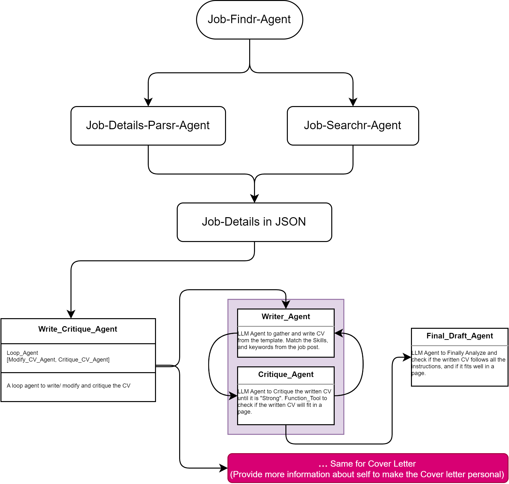
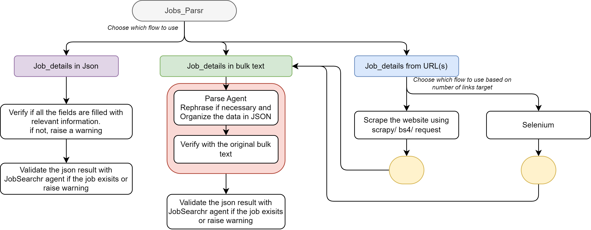
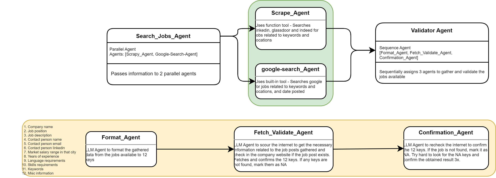

# Job Findr Agent
<!-- center align the badges -->
<p align="center">
  <a href="https://img.shields.io/badge/python-3.10%2B-blue.svg)](https://www.python.org/downloads/">
    
    </a>
    <a href="https://img.shields.io/badge/License-GPLv3-blue.svg">
    
    </a>
    <a href="https://img.shields.io/github/checks-status/sreekar2858/JobSearch-Agent/main">
    
    </a>
    <a href="https://img.shields.io/github/issues/sreekar2858/JobSearch-Agent">
    
    </a>
</p>

---

## Project Status

🚧 **This project is in active development and not ready for production use.**

Planned production release: **May 13, 2025**

---

## Table of Contents
- [Overview](#overview)
- [Features](#features)
- [How it Works](#how-it-works)
- [Project Structure](#project-structure)
- [Prerequisites](#prerequisites)
- [Installation](#installation)
- [Usage](#usage)
- [Configuration](#configuration)
- [Terminal Progress Tracking](#terminal-progress-tracking)
- [Extending](#extending)
- [Contributing](#contributing)
- [License](#license)
- [Contact](#contact)

## Overview

Job Findr Agent is an agentic job search and CV preparation application using Google ADK. It automates job search, scraping, and CV customization for multiple job platforms.

## Features

- **Multi-site Job Search**: Search for jobs on LinkedIn, Indeed, and Glassdoor without requiring API access
- **Targeted Search**: Use optimized search queries for better job matching
- **Automatic CV Generation**: Create customized CVs for each job application
- **Real-time Progress Tracking**: View detailed progress in the terminal

## How it Works

The Job Findr Agent utilizes a clever approach to search for jobs without needing paid APIs:

1. **Smart Google Search**: Uses site-specific Google search queries (e.g., `site:linkedin.com/jobs Python Developer Remote`) to find job listings
2. **Scraping Pipeline**: Extracts complete job details from the search results
3. **CV Customization**: Generates tailored CVs for each job using the Google ADK agent system

<p align="center">

</p>

<p align="center" style="display: flex; justify-content: center;">


</p>


## Project Structure

```
JobSearch-Agent/
├── main.py                # Main entry point for batch processing jobs
├── job_search_cli.py      # Command line interface for job search
├── requirements.txt       # Dependencies list
├── config/                # Configuration files
│   ├── cv_app_agent_config.yaml         # CV agent config
│   ├── file_config.yaml               # File paths config
│   ├── job_app_agent_config.yaml      # Job parser agent config
│   ├── jobsearch_config.yaml          # Job search parameters
│   └── litellm_config.yaml            # LLM config settings
├── data/                  # Document templates
│   ├── SajjalaSreekarReddy_CV.docx      # CV template
│   └── CoverLetter_Template.docx        # Cover letter template
├── jobs/                  # Job posting data storage
│   └── job_postings.json  # Sample job postings
├── output/                # Generated files for each job
│   └── [company]_[role]/  # Folder for each processed job
├── src/                   # Source code modules
│   ├── agents/            # AI agent implementations
│   │   ├── cv_writer.py   # CV generation pipeline
│   │   ├── job_details_parser.py      # Job details parser
│   │   └── search_agents.py           # Job search agents
│   ├── prompts/           # LLM prompt templates
│   │   ├── cv_prompts.py              # CV generation prompts
│   │   └── job_parsr_prompts.py       # Job parsing prompts
│   └── utils/             # Utility functions
│       ├── file_utils.py  # File and config handling
│       ├── scraper.py     # Web scraping utilities
│       ├── job_search_pipeline.py     # Complete search workflow
│       └── exit_conditions.py         # Loop exit conditions
└── README.md
```

## Prerequisites

- Python 3.10+
- Dependencies: Google ADK, python-docx, scrapy, pyyaml, python-dotenv, beautifulsoup4, requests
- Access to Google Search

## Installation

```bash
# Clone the repository
git clone https://github.com/yourusername/job-findr-agent.git
cd job-findr-agent

# Install dependencies
pip install -r requirements.txt

# Add your API keys in .env file
```

## Usage

### Job Search CLI

Use the command-line interface to search for jobs:

```bash
python job_search_cli.py "Python Developer" -l "Remote" "London" -t full-time -m 5
```

Options:
- `keywords`: Job title or keywords to search for
- `-l, --locations`: Locations to search in (default: Remote)
- `-t, --job-type`: Type of job (default: full-time)
- `-e, --experience`: Experience level (default: mid-level)
- `-m, --max-jobs`: Maximum jobs per site/location (default: 3)
- `-c, --generate-cv`: Generate custom CVs for all found jobs

Example output:
```
🔎 Searching for: Python Developer
📍 Locations: Remote, London
💼 Job type: full-time
📊 Experience level: mid-level
🔢 Max jobs per site/location: 5
...
✅ Job search completed successfully!
💾 Results saved to: jobs/job_postings_YYYYMMDD_HHMMSS.json
```

### Process Existing Jobs

Process jobs from a JSON file to generate custom CVs:

```bash
python main.py
```

## Configuration

Edit `config/jobsearch_config.yaml` to set default search parameters:

```yaml
keywords: "Software Developer"
locations: ["Remote", "London"]
job_type: "full-time"
experience_level: "mid-level"
posting_within: "7 days"
```

## Terminal Progress Tracking

The application shows detailed progress in the terminal with emojis indicating each step:

- 🚀 Starting job search pipeline...
- 🌐 Searching LinkedIn jobs...
- 📍 Location: Remote
- 🔍 Query: site:linkedin.com/jobs Software Engineer Remote
- 📝 Generating initial CV draft...
- ✅ Job search completed. Found 12 job postings!

## Extending

### Add New Agent Types

1. Create a new file in `src/agents/`
2. Import and use in the main pipeline

### Add New Job Sites for Scraping

Edit `src/utils/scraper.py` to add new domain selectors:

```python
DOMAIN_SELECTORS = {
    "newjobsite.com": {
        "job_title": "h1.job-title",
        "company_name": "span.company",
        ...
    },
    ...
}
```

## Contributing

Contributions are welcome! Please open an issue or submit a pull request for improvements or bug fixes.

## License
GPL-3.0 License

## Contact

For questions or support, please open an issue on GitHub or contact the maintainer at [sreekar2858@gmail.com](mailto:sreekar2858@gmail.com).
